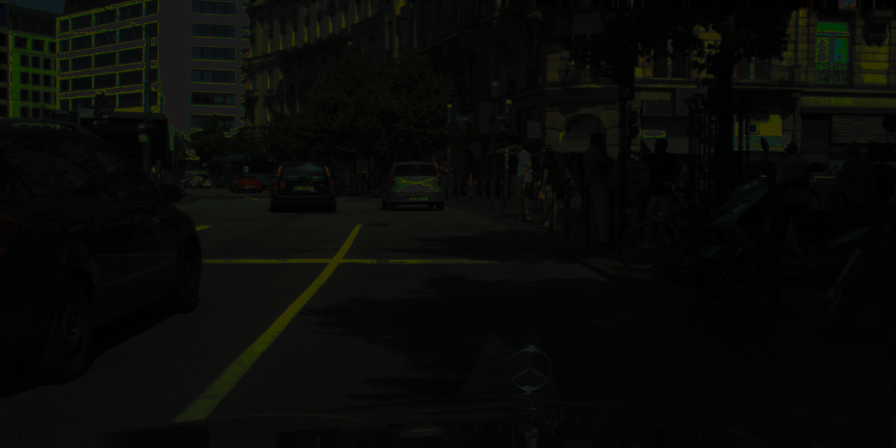

# DarkCityScape_mIOU_mPA
This is a repository for calculating the mIOU (mean intersection over union) and mPA (mean pixel accuracy) for DarkCityScapes. DarkCityScapes is the "Dark version" of the CityScape dataset [1] and is specifically designed for extreme low-light image enhancement tasks. 
The dataset is simulated using gamma correction on 150 CityScape validation images. 

# Sample Images from DarkCityScapes

# Get Started
1. Download the DarkCityScape dataset from [Baiduyun](https://pan.baidu.com/s/1--xG3uNuH_9rKzcHpQKqgQ) with passord `wvhy`

2. Download the DarkCityScape labels from [Baiduyun](https://pan.baidu.com/s/1SlNCx7SknnQ_NUD57e0Q4w) with password `a2z5`

3. Put the segmentation outcome of the enhanced images in `path_to_your_pred`
   And the Groudtruth segmentation labels in `path_to_your_gt`

Note: 
- You could refers to `Dark.txt` if you are not sure how to put the images.
- The size of 'pred' and 'gt' should be same. 

4. Run the following script `python main.py --pred path_to_your_pred --gt path_to_your_gt`

The result of mIOU and mPA will be in `output_iou.txt` and `output_pa.txt`, respectively.

# Sample Result
Following is the result table from some state-of-the-art low-light image enhancement models
|      | Dark   | PIE [2]| Retinex [3] | MBLLEN [4] | KinD [5]   | ZeroDCE [6] |
|------|--------|--------|---------|--------|--------|---------|
| mIOU | 54.49% | 61.97% | 57.96%  | 51.98% | 63.42% | 64.36%  |
| mPA  | 70.76% | 68.89% | 66.76%  | 59.06% | 71.69% | 74.20%  |

# References:
[1] Cordts, Marius, et al. "The cityscapes dataset for semantic urban scene understanding." Proceedings of the IEEE conference on computer vision and pattern recognition. 2016.

[2] Fu, Xueyang, et al. "A probabilistic method for image enhancement with simultaneous illumination and reflectance estimation." IEEE Transactions on Image Processing 24.12 (2015): 4965-4977.

[3] Wei, Chen, et al. "Deep retinex decomposition for low-light enhancement." arXiv preprint arXiv:1808.04560 (2018).

[4] Lv, Feifan, et al. "MBLLEN: Low-Light Image/Video Enhancement Using CNNs." BMVC. 2018.

[5] Zhang, Yonghua, Jiawan Zhang, and Xiaojie Guo. "Kindling the darkness: A practical low-light image enhancer." Proceedings of the 27th ACM international conference on multimedia. 2019.

[6] Guo, Chunle, et al. "Zero-reference deep curve estimation for low-light image enhancement." Proceedings of the IEEE/CVF Conference on Computer Vision and Pattern Recognition. 2020.

